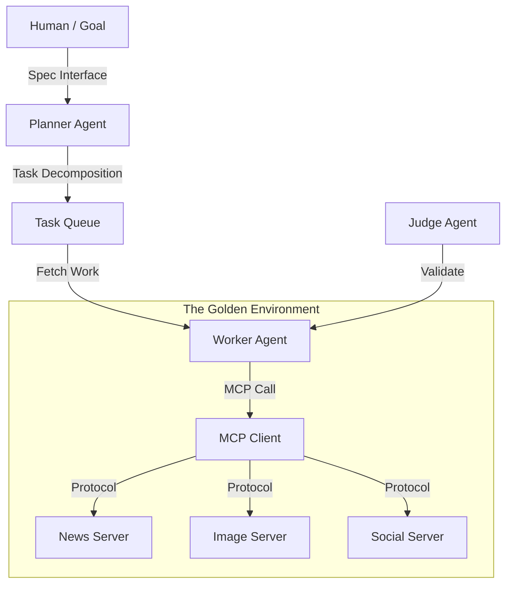

# Project Chimera: Autonomous Influencer Swarm
> **Agentic Infrastructure for the Next Generation of AI Social Activity**


**Project Chimera** is a sophisticated multi-agent system built for the **10Academy 3-Day Agent Challenge**. It implements a fractal swarm of autonomous agents capable of **Perception, Reasoning, and Action** in the digital economy.

---

## 🚀 Key Achievement: The Autonomous Loop
We have successfully implemented and verified the Core Autonomous Loop (`scripts/run_autonomous_loop.py`).

The system performs the following sequence **without human intervention**:
1.  **🧠 Plan:** The `PlannerAgent` analyzes high-level goals.
2.  **👀 Perceive:** Fetches real-time tech trends via the **MCP News Server** (`news_server.py`).
3.  **💭 Reason:** Uses LLM (Gemini) to synthesize trends into creative concepts.
4.  **🎨 Act:** Generates high-fidelity visual assets using the **MCP Image Server**.

---

## 🏗️ Technical Architecture

This project strictly follows **Spec-Driven Development** and the **FastRender Swarm** pattern:



### Core Components
*   **Source of Truth:** All code is downstream from `specs/` (Functional, Technical).
*   **Model Context Protocol (MCP):** Standardized interface for all external tools.
*   **Fractal Orchestration:** Architecture designed to scale from 1 to 100s of agents.

---

## ⚡ Quick Start (For Judges)

### 1. Verification
To verify the system integrity and independent agency:

```bash
# 1. Install dependencies
make setup

# 2. Run the Autonomous Loop (The "Showcase")
uv run python scripts/run_autonomous_loop.py

# 3. Run the Test Suite (TDD Proof)
make test
```

### 2. Project Structure
The repository is organized for clarity and scalability:

*   `specs/`: **The Constitution.** All functional and technical constraints.
*   `chimera/agents/`: **The Brains.** Planner, Worker, and Judge implementations.
*   `chimera/mcp/`: **The Tools.** Independent servers for News, Images, and Social.
*   `tests/`: **The Proof.** Comprehensive tests for Scalability, Integration, and Logic.

---

## 🙏 Acknowledgments

A huge thank you to the **10Academy Team** for this intense and rewarding challenge.

*   **To the Mentors:** For the invaluable guidance during **Daily Meets** and for pushing us to adopt professional standards like Spec-Driven Development.
*   **To the Community:** For the real-time support on **Slack** and the shared learning spirit during the intense "Empty Slot" phase.
*   **To the Reviewers:** Thank you for your time and attention to detail in evaluating this submission.

This project represents not just code, but a leap in understanding **Agentic Architecture**.

---

*Verified Submission - Feb 2026*
